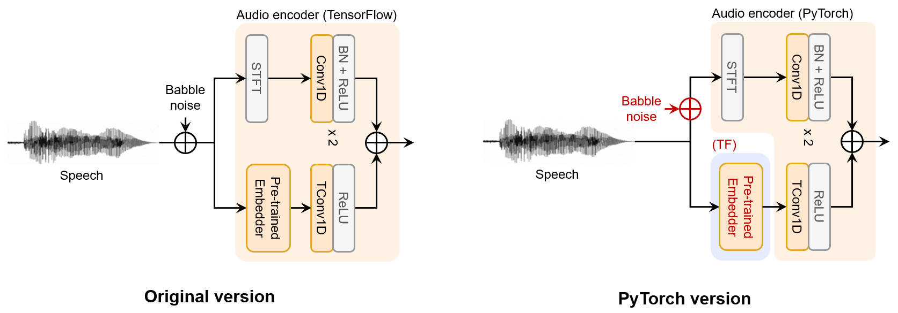

# :mag: PhonMatchNet_torch
PyTorch implementation of PhonMatchNet: Phoneme-Guided Zero-Shot Keyword Spotting for User-Defined Keywords.

TensorFlow version: https://github.com/ncsoft/PhonMatchNet

## Requirements

### Datasets

* [LibriPhrase](https://github.com/gusrud1103/libriphrase)

* [Google Speech Commands](https://arxiv.org/abs/1804.03209)

* [Qualcomm Keyword Speech](https://developer.qualcomm.com/project/keyword-speech-dataset)

Download the dataset and prepare it according to each guide. 


## Getting started

### Environment

```bash
cd ./docker
docker build --tag udkws_torch .
```

### Data Preprocessing
```bash
cd ./google_speech_embedding/docker
docker build --tag preprocess .
cd ../..
docker run -it --rm \
    -v /path/to/this/repo:/home/ \
    -v /path/to/prepared/dataset:/home/DB \
    preprocess \
    /bin/bash -c \
    "python ./google_speech_embedding/preprocess.py"

```

### Training

```bash
docker run -it --rm --gpus '"device=0,1"' --ipc=host -v \
    -v /path/to/this/repo:/home/ \
    -v /path/to/prepared/dataset:/home/DB \
    udkws_torch \
    /bin/bash -c \
    "python train.py \
        --epoch 100 \
        --lr 1e-3 \
        --loss_weight 1.0 1.0 \
        --audio_input both \
        --text_input g2p_embed \
        --stack_extractor \
        --comment 'user comments for each experiment'"

```

### Monitoring

```bash
tensorboard --logdir ./log/ --bind_all
```

## Performance

### EER
| PMNet version                    | G     | Q     | LP_E  | LP_H  |
|----------------------------------|-------|-------|-------|-------|
| Official (tf)                    | 6.77  | 4.75  | 2.80  | 18.82 |
| PyTorch-based: partial noise (*) | 7.07  | 7.72  | 3.38  | 21.55 |

### AUC
| PMNet version                    | G     | Q     | LP_E  | LP_H  |
|----------------------------------|-------|-------|-------|-------|
| Official (tf)                    | 98.11 | 98.90 | 99.29 | 88.52 |
| PyTorch-based: partial noise (*) | 97.75 | 98.06 | 99.43 | 86.50 |


(*) Partial noise refers to applying noise exclusively to the raw audio and not to the pre-processed Google Speech embeddings. Further details are provided below in the [Comparisons with the Original Implementation](#comparisons-with-the-original-implementation) section.

## In Details

### Directory Structure
```
├── criterion
│    ├── total.py               - Implements BinaryCrossEntropy loss on both utterance level and phoneme level.
│    └── utils.py               - Contains utilities for calculating Equal Error Rate (EER).
│
├── dataset
│    ├── g2p    
│    ├── __init__.py            - Contains Dataloader class for all datasets.
│    ├── google.py              - Defines datasets and collation functions for each dataset.
│    ├── libriphrase.py    
│    └── qualcomm.py    
│
├── docker
│    └── Dockerfile             - Dockerfile for training (PyTorch).
│
├── google_speech_embedding
│    ├── docker             
│    │    └── Dockerfile        - Dockerfile for embedding preprocessing (TensorFlow).
│    │
│    ├── checkpoint             - Contains SavedModel checkpoint of Google Speech Embedding model.
│    ├── preprocess.py          - Script to save Google Speech embeddings before training.
│    └── speech_embedding.py    - Original code for Google Speech embeddings.
│
├── model
│    ├── discriminator.py       - Implements Pattern Discriminator at the phoneme level.
│    ├── encoder.py             - Contains audio and text encoders.
│    ├── extractor.py           - Implements Pattern Extractor using cross/self-attention.
│    ├── log_melspectrogram.py  - Generates Mel-spectrogram for each raw input.
│    ├── ukws.py                - Implements PhonMatchNet.
│    ├── utils.py
│    └── lin_to_mel_matrix.npy  - Pre-computed matrix supporting TF-like Melgram extraction.
│
└── train.py                    - Training script using Hugging Face Accelerate.
```

### Comparisons with the Original Implementation
* Dataset: Identical to the original TensorFlow code.

* Google Speech Embeddings: Converting the Google Speech Embedding model from TensorFlow to PyTorch was found to be a time-consuming task, if not altogether unfeasible. Therefore, we have chosen to provide preprocessing code instead.  As a result, full support for training with noise in the PyTorch version is not feasible, as preprocessing audio to accommodate all possible noise combinations is impractical. Specifically, while you can still apply noise to the raw waveform, Google Speech Embeddings should be preprocessed without noise.

<p align="center">
    
</p>

* Model
    - The PyTorch version requires a mask for each input. 
        - On TensorFlow version: 
            ```
            class AudioEncoder(Encoder):
                ...
                def call(self, src):
                    ...
                    if mask_flag:
                        x._keras_mask = mask
                    ...
            ```
        - On PyTorch version:
            ```
            class AudioEncoder(Encoder):
                ...
                def forward(self, src, src_mask=None):
                    ...
                    x = torch.nan_to_num(x) * mask
                    ...
            ```
    - To calculate the melspectrogram, `lin_to_mel_matrix.npy` is extracted from `tf.signal.linear_to_mel_weight_matrix`, which is utilized from the [official branch](https://github.com/ncsoft/PhonMatchNet/blob/d6f350a6e9ba2f95788a544249bf5d7cb7d35981/model/log_melspectrogram.py#L19). If you want to change any configurations related to spectrogram, this matrix should be re-extracted, or you would have to use other packages. 


## Acknowledgement

This work was supported by the [KAIST SoC Co-op Internship Program](https://cs.kaist.ac.kr/content?menu=217) funded by NCSOFT. The code in this branch was authored by Eugene Seo, KAIST (eugene.s21@kaist.ac.kr).
